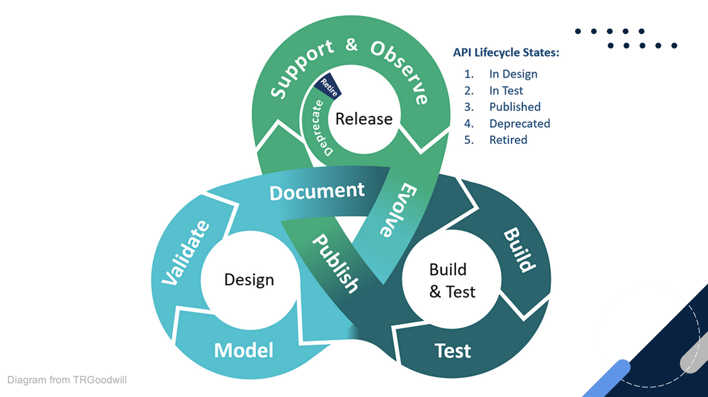
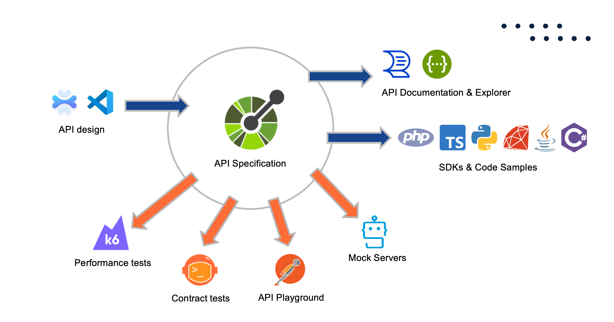
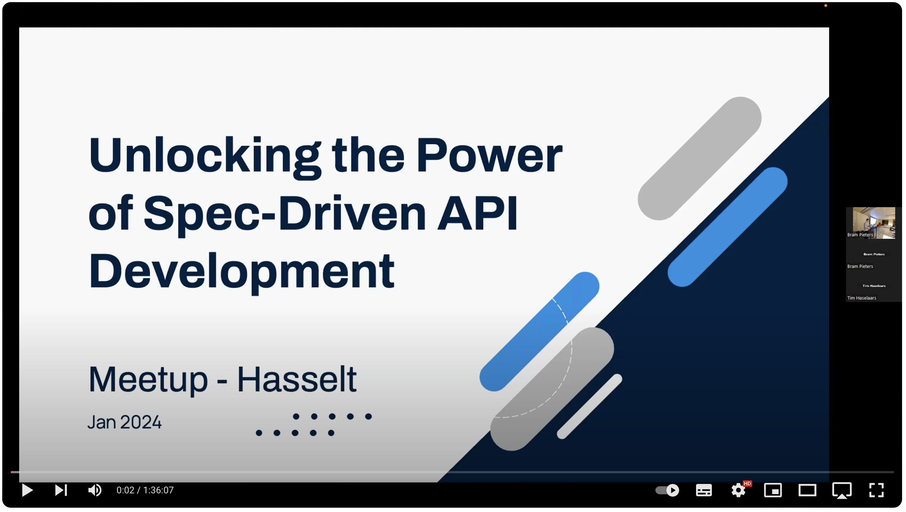

### OpenAPI Spec-driven concept

> Congrats, you just launched 🚀 an API! And next the questions are pouring in: Where are the docs? How many requests per minute can it handle? Which fields are required? How to test the API? 🤔

This repo contains a proof-of-concept used during a presentation about "Unlocking the Power of Spec-Driven API Development", for the Meetup: https://www.meetup.com/php-limburg-be/events/298068752/

It provides a working Marvel API, which is used to demonstrate all the steps & benefits of Spec-Driven API Development.

The outcome of this proof-of-concept is a working API, with a full set of documentation, tests, mock server, performance tests, client SDKs, ...

The meetup is recorded and can be watched on Youtube:
https://www.youtube.com/watch?v=YXRstde1SeA&t=198s

## Getting started

The repository contains a OpenAPI Spec file `openapi.yml`, which is used as the central source to generate documentation, mock server, postman collection, contract tests, performance tests and client SDKs.

Per folder, you can find a `package.json` file which contains the tools & scripts to generate the outputs.

### REST API Server

The REST API Server can be started in the folder "restapi-server" by running `npm run server-start`.
It is a simple NodeJS/Express/Prisma API server using SQLite. It provides a full CRUD API for managing Marvel characters, teams & movies.

## Publish documentation

Examples for using Redoc, Swagger UI, Scalar can be found in the folder "restapi-server/public/docs".

### Publish Postman Collection

The scripts to generate the Postman Collection can be found in the folder `publish-postman`

### Publish OpenAPI Spec

The scripts to generate the OpenAPI Spec can be found in the folder `publish-openapi`

### Generate Mock Server

The Mock server can be started in the folder "mock-prism" by running `npm run mock`

### Generate Contract Tests

The Contract Tests scripts can be found in the folder "testing-contract".

### Generate Performance Tests

The Performance Tests scripts can be found in the folder "testing-k6".

### Generate Client SDKs

The Client SDKs scripts can be found in the folder "client-sdk".
